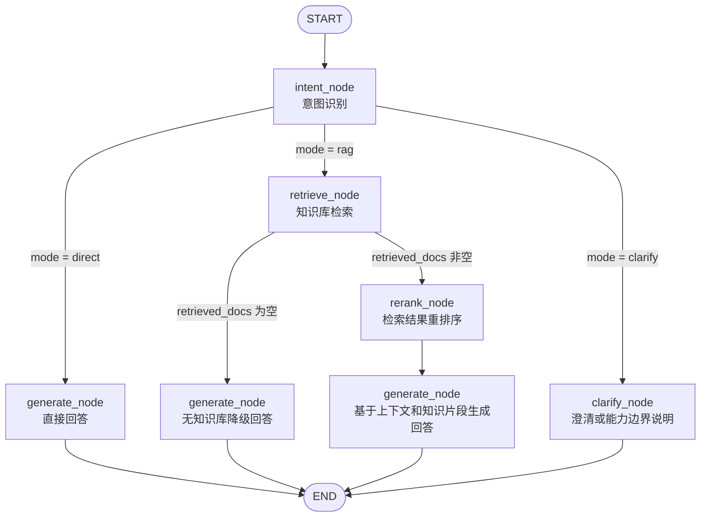
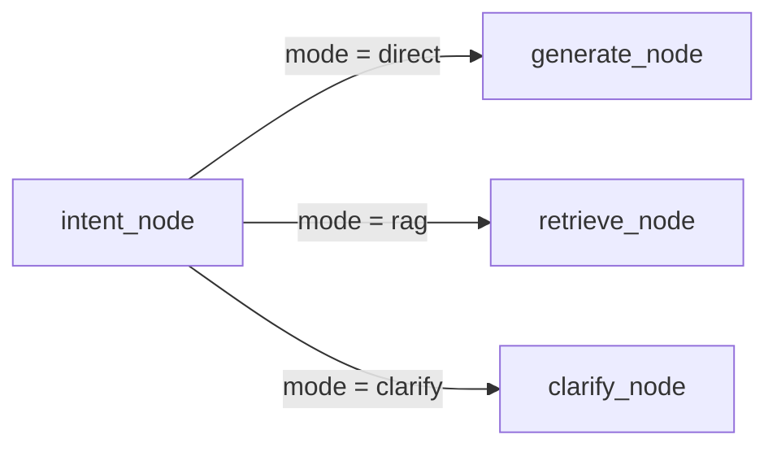
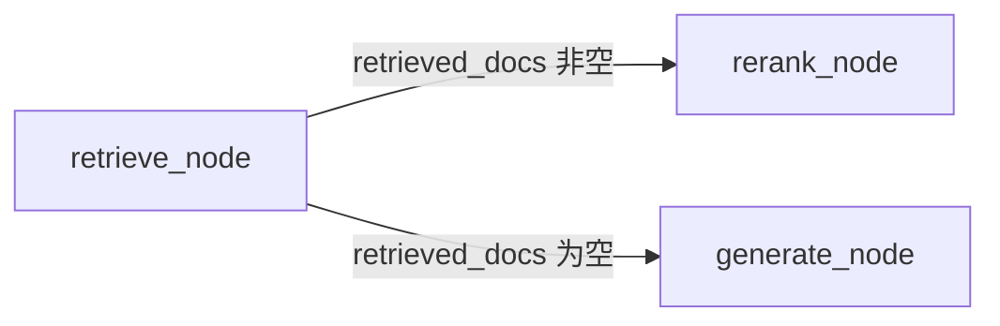

# qa-agent 智能体工作流节点说明

## 1. 文档目的

本文档说明 `qa-agent` 中 LangGraph 智能体的节点组成、路由关系、节点职责和关键状态字段，便于后端、前端、知识库模块和测试同学理解完整执行链路。

核心实现文件：

| 文件 | 说明 |
|---|---|
| `qa-agent/graph/workflow.py` | 定义 LangGraph 节点、边和条件路由。 |
| `qa-agent/graph/nodes.py` | 实现各节点逻辑。 |
| `qa-agent/graph/state.py` | 定义 `AgentState` 状态结构。 |
| `qa-agent/api/chat.py` | 将图执行结果转换为 HTTP/SSE 输出。 |

## 2. 工作流 Mermaid 图



## 3. 节点总览

| 节点 | 触发条件 | 主要职责 | 输出重点 |
|---|---|---|---|
| `intent_node` | 工作流开始后固定进入 | 识别用户意图、判断路由模式、初始化可观测字段。 | `intent`、`mode`、`thinking_steps`。 |
| `clarify_node` | `mode=clarify` | 对低置信度、上下文不足或未开放能力进行澄清。 | `final_response`、`thinking_steps`。 |
| `retrieve_node` | `mode=rag` | 调用知识库检索适配器并按阈值过滤文档。 | `retrieved_docs`、`thinking_steps`。 |
| `rerank_node` | `retrieved_docs` 非空 | 按分数重排并截取 Top K。 | `retrieved_docs`、`thinking_steps`。 |
| `generate_node` | `mode=direct`、检索为空或重排序后 | 构建 prompt、流式调用 LLM、生成回答和引用。 | `final_response`、`citations`、`thinking_steps`。 |

## 4. 关键状态字段

| 字段 | 含义 |
|---|---|
| `messages` | 历史消息，API 层从会话记录读取后传入图。 |
| `question` | 当前用户问题。 |
| `selected_kb_ids` | 用户选择的知识库范围。 |
| `intent` | 识别出的意图。 |
| `intent_confidence` | 意图置信度，范围 `0.0` 到 `1.0`。 |
| `classification_source` | 分类来源：`rule`、`llm`、`fallback`。 |
| `needs_clarification` | 是否需要澄清。 |
| `mode` | 路由模式：`direct`、`rag`、`clarify`。 |
| `retrieved_docs` | 标准化后的知识库片段。 |
| `thinking_steps` | 工作流思考步骤。 |
| `citations` | 回答引用来源。 |
| `final_response` | 最终回答。 |
| `error` | 受控错误信息。 |

## 5. intent_node

### 5.1 职责

`intent_node` 是工作流入口节点，负责从 `question` 或最后一条 `messages` 中提取用户问题，并判断问题应走哪条路径。

### 5.2 分类方式

1. 优先使用规则分类，覆盖闲聊、知识问答、文档检索、报告生成、知识库管理、任务动作和模糊请求。
2. 规则无法判断且配置了 `LLM_API_KEY` 时，调用 LLM 做 JSON 结构化分类。
3. LLM 不可用、调用失败或返回非法 JSON 时，进入 `fallback`，并走澄清路径。

### 5.3 主要输出

```json
{
  "intent": "KNOWLEDGE_QA",
  "intent_confidence": 0.8,
  "classification_source": "rule",
  "needs_clarification": false,
  "mode": "rag",
  "retrieved_docs": [],
  "citations": []
}
```

同时追加思考步骤：

```json
{
  "type": "intent",
  "message": "识别意图: KNOWLEDGE_QA，置信度 0.80，来源 rule。命中知识问答表达。",
  "timestamp": 1782734400.0,
  "elapsed_ms": null
}
```

## 6. clarify_node

### 6.1 触发条件

以下情况会进入 `clarify_node`：

- 用户输入为空或缺少上下文。
- 意图置信度低于阈值。
- 命中当前未开放执行能力：`REPORT_GENERATION`、`KB_MANAGEMENT`、`TASK_ACTION`。
- 规则和 LLM 都无法可靠分类。

### 6.2 输出行为

普通澄清会要求用户补充材料、具体问题或期望输出。未开放能力会说明当前迭代只支持问答和文档检索编排，不直接执行该操作。

示例输出：

```json
{
  "final_response": "我还需要更多信息才能准确处理。请求缺少材料、目标或输出要求，需要先澄清。请补充要分析的材料、具体问题或期望输出。",
  "retrieved_docs": [],
  "citations": []
}
```

## 7. retrieve_node

### 7.1 触发条件

`intent_node` 输出 `mode=rag` 时进入该节点。当前 RAG 意图包括：

- `KNOWLEDGE_QA`
- `DOCUMENT_SEARCH`

### 7.2 处理流程

1. 读取当前问题。
2. 调用 `embed_query()` 生成 embedding；未配置 embedding 时可为空。
3. 调用 `search_knowledge()` 访问知识库 HTTP 检索接口。
4. 按 `default_similarity_threshold` 过滤低分文档。
5. 写入 `retrieved_docs`。

### 7.3 知识库请求字段

```json
{
  "query": "用户问题",
  "selected_kb_ids": [1, 2],
  "top_k": 5,
  "similarity_threshold": 0.7,
  "embedding": null
}
```

检索失败、未配置知识库地址或返回结构不合法时，适配器返回空数组，工作流继续走无知识库降级生成。

## 8. rerank_node

### 8.1 触发条件

`retrieve_node` 返回的 `retrieved_docs` 非空时进入 `rerank_node`。

### 8.2 职责

`rerank_node` 根据当前问题和检索结果调用 `rerank()`，按分数重新排序并截取 Top K。

### 8.3 输出示例

```json
{
  "retrieved_docs": [
    {
      "doc_id": "doc_001",
      "doc_name": "技术监督管理办法.pdf",
      "snippet": "技术监督是指...",
      "score": 0.92
    }
  ]
}
```

## 9. generate_node

### 9.1 触发路径

`generate_node` 有三类入口：

- `CHAT` 直答路径：`intent_node -> generate_node`。
- RAG 空检索路径：`intent_node -> retrieve_node -> generate_node`。
- RAG 有检索路径：`intent_node -> retrieve_node -> rerank_node -> generate_node`。

### 9.2 Prompt 构建

生成节点调用 `build_context()` 构建有 token 限制的多轮上下文，并移除历史消息末尾与当前问题重复的用户消息。

Prompt 组成顺序：

1. 系统提示词。
2. 历史对话上下文。
3. 知识库片段，若有检索结果。
4. 无知识库提示，若 RAG 路径未检索到结果。
5. 当前用户问题。

### 9.3 流式输出

`generate_node` 调用 `_stream_chat_model()` 获取 LLM token，并通过 LangGraph custom writer 输出：

```json
{
  "delta": "技"
}
```

API 层会将该 delta 转换为 SSE `message` 事件。

### 9.4 引用构建

如果存在检索文档，生成节点使用：

- `build_citations(documents)` 构造引用。
- `merge_consecutive_citations(citations)` 合并同文档连续引用。

输出示例：

```json
{
  "final_response": "技术监督是指...",
  "citations": [
    {
      "index": 1,
      "doc_id": "doc_001",
      "doc_name": "技术监督管理办法.pdf",
      "snippet": "技术监督是指...",
      "full_snippet": "技术监督是指...",
      "score": 0.92
    }
  ]
}
```

## 10. 路由规则

### 10.1 intent 后路由



`route_by_intent()` 只接受 `rag`、`direct`、`clarify` 三种模式。缺失或非法模式会兜底到 `clarify`。

### 10.2 retrieve 后路由



`route_if_empty()` 根据 `retrieved_docs` 是否为空决定是否重排序。

## 11. 与 SSE 接口的关系

`POST /api/chat` 会把 LangGraph 输出转换为前端可消费的 SSE 事件：

| 图输出 | SSE 事件 | 说明 |
|---|---|---|
| `thinking_steps` | `thinking` | 使用 `to_sse_event()` 转换为 `step_type` 结构。 |
| custom `delta` | `message` | token 级增量输出，`finished=false`。 |
| `citations` | `citation` | 使用 `citation_to_sse()` 输出一个合并引用事件。 |
| `final_response` | `message` | 最终确认事件，`finished=true`。 |
| 正常结束 | `done` | 返回 `message_id` 和 `conversation_id`。 |

## 12. 验证命令

```bash
python -m pytest qa-agent/tests/test_chat.py -v
python -m compileall qa-agent qa_agent
```

当前合并后的验证结果为 `32 passed`，编译检查通过。
