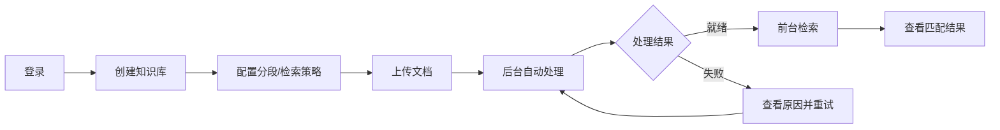

# 产品需求文档（PRD）
## 智能知识管理与报告生成系统 — 知识管理子系统

| 属性 | 内容 |
|------|------|
| 文档版本 | v1.0 |
| 创建日期 | 2026-06-27 |
| 产品负责人 | 知识管理组（7 人） |
| 所属产品 | 技术监督辅助平台 / 智能知识管理与报告生成系统 |
| 目标版本 | MVP v1.0（2026-07-05 答辩） |

---

## 1. 产品概述

### 1.1 产品定位

知识管理子系统是整平台的**知识资产底座**，面向电力行业技术监督场景，提供知识库管理、文档上传与自动处理、语义检索能力，并为知识问答（RAG）和报告生成模块提供标准化检索 API。

### 1.2 产品价值

| 用户 | 价值 |
|------|------|
| 电厂技术人员 | 快速检索规程、报告、术语等专业文档内容 |
| 知识管理员 | 统一管理多类型知识库，配置分段与检索策略 |
| 问答/报告模块（内部消费方） | 通过 API 获取高质量向量检索结果 |

### 1.3 产品边界

```
┌────────────────────────────────────────────────────────┐
│                   集成平台（第四仓库，后期）              │
└─────────┬──────────────────┬─────────────────────────┘
          │                  │
   ┌──────▼──────┐    ┌──────▼──────┐    ┌─────────────┐
   │ 知识管理 ✅  │    │ 知识问答     │    │ 报告生成     │
   │ （本产品）   │───▶│ 消费检索API  │    │ 消费检索API  │
   └─────────────┘    └─────────────┘    └─────────────┘
```

| 本产品包含 | 本产品不包含 |
|------------|--------------|
| 登录注册、知识库/文档管理、处理管线、前台检索、模型配置、统计看板、对外 Search API | 智能对话、RAG 问答 UI、引用溯源、报告生成、素材/模板管理、全平台细粒度 RBAC |

---

## 2. 产品目标

### 2.1 核心目标

1. 用户可在 **3 步内**完成「建库 → 上传文档 → 检索到结果」
2. 文档处理全链路状态可视，失败可重试
3. 检索 API 稳定可供问答组对接，P95 响应 < 2s（不含外部模型超时）
4. 答辩 Demo 可完整演示核心闭环

### 2.2 成功指标（MVP）

| 指标 | 目标 |
|------|------|
| 支持文档格式 | ≥ 6 种（PDF/DOCX/PPTX/XLSX/MD/TXT） |
| 文档处理成功率 | ≥ 95%（答辩样例文档） |
| 核心页面可用性 | 登录、知识库、文档、检索、配置 5 大模块无阻塞 Bug |
| 对外 API | `/api/search` 有 OpenAPI 文档且联调通过 |

---

## 3. 用户画像

### 3.1 普通用户（技术员）

- **场景**：查找设备异常处理规程、技术标准条款
- **痛点**：文档分散、关键词搜不准、不知道在哪份文件
- **期望**：自然语言搜索，直接看到相关段落和来源文档

### 3.2 知识管理员

- **场景**：维护知识库、上传批量文档、调整检索效果
- **痛点**：文档格式杂、处理失败难排查、策略调整后需重新入库
- **期望**：可视化状态、可配置策略、一键重处理

### 3.3 系统管理员

- **场景**：配置嵌入/重排序模型、查看系统运行指标
- **痛点**：模型 API 变更需改代码重启
- **期望**：运行时热配置，界面脱敏展示密钥

### 3.4 内部 API 消费方（问答组/报告组）

- **场景**：RAG 检索、引用溯源、报告素材匹配
- **期望**：稳定、文档齐全的 REST API，响应结构固定

---

## 4. 信息架构

### 4.1 站点地图

```
知识管理系统
├── 登录 / 注册
├── 前台
│   └── 知识检索
└── 管理后台
    ├── 概览（统计）
    ├── 知识库管理
    │   ├── 知识库列表
    │   ├── 新建/编辑知识库
    │   └── 知识库详情（文档列表）
    │       ├── 上传文档
    │       ├── 文档列表
    │       └── 切片详情（弹窗/抽屉）
    └── 系统设置
        ├── 嵌入模型配置
        ├── 重排序模型配置
        └── 解析器配置
```

### 4.2 导航结构

| 区域 | 导航项 | 权限 |
|------|--------|------|
| 顶栏 | 知识检索、管理后台、用户菜单（退出） | 登录用户 |
| 管理后台侧栏 | 概览、知识库、系统设置 | 管理员 |
| 知识库详情 | 文档列表 Tab（默认）、库配置 Tab | 管理员 |

---

## 5. 核心用户流程

### 5.1 主流程：知识入库与检索



### 5.2 文档处理状态机

```
已上传 → 解析中 → 切片中 → 向量化中 → 就绪
                              ↘ 失败（可重试）
```

| 状态 | 用户可见文案 | 允许操作 |
|------|--------------|----------|
| 已上传 | 已上传 | 删除 |
| 解析中 | 解析中 | 删除（需确认） |
| 切片中 | 切片中 | — |
| 向量化中 | 向量化中 | — |
| 就绪 | 就绪 | 查看切片、编辑标签、删除 |
| 失败 | 处理失败 | 查看错误、重试、删除 |

### 5.3 策略变更重处理流程

1. 管理员修改知识库的分段策略或检索策略
2. 系统弹出确认：「策略变更将重新处理该库下所有就绪文档，是否继续？」
3. 确认后，所有「就绪」文档状态变为「已上传」，重新进入处理管线

---

## 6. 功能需求详述

> 优先级：P0 = MVP 必须；P1 = 答辩前完成；P2 = 加分项

### 6.1 登录与注册 【P0】

#### 用户故事

| ID | 故事 | 验收标准 |
|----|------|----------|
| US-A01 | 作为新用户，我要能注册账号 | 用户名唯一；密码 ≥ 6 位；注册成功跳转登录 |
| US-A02 | 作为用户，我要能登录系统 | 正确凭证进入首页；错误凭证有提示 |
| US-A03 | 作为用户，刷新页面后保持登录 | Token 未过期时无需重新登录 |
| US-A04 | 作为用户，我要能退出登录 | 清除本地 Token，跳转登录页 |

#### 页面规格：登录页

| 元素 | 规格 |
|------|------|
| 用户名 | 必填，文本输入 |
| 密码 | 必填，密码框 |
| 登录按钮 | 主按钮；Loading 态防重复提交 |
| 注册入口 | 链接跳转注册页 |
| 错误提示 | 表单上方红色 Alert |

#### 业务规则

- 所有 `/api/**` 需 JWT，白名单：`/api/auth/login`、`/api/auth/register`
- JWT Payload 含：`userId`、`username`、`role`（`USER` / `ADMIN`）

---

### 6.2 知识库管理 【P0】

#### 用户故事

| ID | 故事 | 验收标准 |
|----|------|----------|
| US-KB01 | 创建知识库 | 填写名称、描述、文档类型、策略后保存成功 |
| US-KB02 | 编辑知识库 | 可修改名称、描述、策略配置 |
| US-KB03 | 删除知识库 | 二次确认；级联删除文档与向量数据 |
| US-KB04 | 浏览知识库列表 | 展示名称、类型、文档数、创建人、创建时间 |
| US-KB05 | 筛选与搜索 | 按类型下拉筛选；名称关键词搜索 |
| US-KB06 | 批量删除 | 多选后批量删除，二次确认 |

#### 页面规格：知识库列表

| 列/元素 | 说明 |
|---------|------|
| 多选框 | 支持全选当前页 |
| 名称 | 点击进入详情 |
| 文档类型 | 标签样式：规程规范 / 技术报告论文 / 术语条目 / 通用文档 |
| 文档数 | 数字 |
| 创建人 / 创建时间 | 文本 |
| 操作 | 编辑、删除 |

#### 页面规格：新建/编辑知识库表单

| 字段 | 类型 | 必填 | 说明 |
|------|------|------|------|
| 名称 | 文本 | 是 | 最长 100 字符 |
| 描述 | 多行文本 | 否 | 最长 500 字符 |
| 文档类型 | 单选 | 是 | 四类枚举 |
| 分段策略 | 单选 | 是 | 见 6.2.1 |
| 检索策略 | 单选 | 是 | 语义向量 / 向量+重排序 |

##### 6.2.1 分段策略配置

**模式一：基于标题层级**

- 按 H1/H2/H3 等标题切分
- 无额外参数

**模式二：固定字符数**

| 参数 | 默认值 | 范围 |
|------|--------|------|
| 切片长度 | 512 | 128–2048 |
| 重叠长度 | 50 | 0–256 |
| 分隔符 | `\n\n` | 自定义字符串 |
| 递归合并 | 关闭 | 开/关 |

##### 6.2.2 检索策略

| 选项 | 说明 |
|------|------|
| 语义向量检索 | 仅向量相似度排序 |
| 向量检索 + 重排序 | 向量召回后调用重排序模型 |

---

### 6.3 文档管理 【P0】

#### 用户故事

| ID | 故事 | 验收标准 |
|----|------|----------|
| US-DOC01 | 上传文档 | 支持拖拽和点击；可添加标签 |
| US-DOC02 | 查看处理状态 | 列表实时展示状态；处理中显示进度指示 |
| US-DOC03 | 失败重试 | 失败文档展示错误原因；点击重试重新处理 |
| US-DOC04 | 查看切片 | 就绪文档可打开切片列表，含内容与章节路径 |
| US-DOC05 | 编辑标签 | 弹窗编辑键值对标签 |
| US-DOC06 | 删除文档 | 单个/批量删除，二次确认 |
| US-DOC07 | 筛选与分页 | 按状态筛选；分页默认 20 条/页 |

#### 页面规格：文档上传区

| 元素 | 规格 |
|------|------|
| 拖拽区 | 虚线框，文案「拖拽文件到此处，或点击上传」 |
| 格式提示 | 支持 PDF、DOCX、PPTX、XLSX、MD、TXT、JPG/PNG |
| 大小限制 | 单文件 ≤ 50MB，超出提示 |
| 标签输入 | 可选；键值对形式，如 `专业:汽机` |
| 上传列表 | 显示文件名、大小、上传进度 |

#### 页面规格：文档列表

| 列 | 说明 |
|----|------|
| 文件名 | 带格式图标 |
| 标签 | Tag 列表，可点击编辑 |
| 状态 | 彩色 Badge（就绪=绿，失败=红，处理中=蓝） |
| 上传时间 | 格式化显示 |
| 操作 | 切片详情、重试（失败时）、删除 |

#### 页面规格：切片详情（抽屉）

| 元素 | 说明 |
|------|------|
| 切片序号 | #1, #2, ... |
| 章节路径 | 如「第2章 > 2.1 设备概述」 |
| 内容预览 | 可滚动文本区 |
| 字符数 | 辅助信息 |

---

### 6.4 文档解析与处理（系统能力）【P0】

#### 功能说明

上传后自动触发异步处理，用户无需手动操作。

#### 处理管线

```
存储原文件 → 入队(MQ) → 解析为文本 → 按策略切分 → 调用嵌入API → 写入向量库 → 更新状态
```

#### 配置项（系统设置中）

| 配置 | 默认值 | 说明 |
|------|--------|------|
| 最大并发任务数 | 3 | 1–10 |
| 解析后端 | Tika | 可切换（至少预留 2 个适配器接口） |

#### 验收标准

- [ ] 上传后不阻塞页面，用户可继续操作
- [ ] 状态按序流转，终态为就绪或失败
- [ ] 并发超限时任务排队，不丢失

---

### 6.5 前台知识检索 【P0】

#### 用户故事

| ID | 故事 | 验收标准 |
|----|------|----------|
| US-SR01 | 输入问题检索 | 回车或点击搜索触发 |
| US-SR02 | 选择检索范围 | 多选知识库；默认全选有权限的库 |
| US-SR03 | 查看结果 | 展示文档名、分数、摘要、章节路径 |
| US-SR04 | 过滤结果 | 支持相似度阈值、标签过滤 |
| US-SR05 | 展开详情 | 点击结果卡片展开完整匹配片段 |

#### 页面规格：检索页

```
┌─────────────────────────────────────────────────┐
│  🔍 [ 请输入检索内容...                    ] [搜索] │
├─────────────────────────────────────────────────┤
│  检索范围: ☑规程库  ☑术语库  ☐报告库              │
│  高级选项 ▼                                      │
│    检索模式: ○语义向量  ●向量+重排序               │
│    Top K: [10]  相似度阈值: [0.6]                │
│    标签过滤: [专业 ▼] [值    ]                   │
├─────────────────────────────────────────────────┤
│  共 5 条结果                                     │
│  ┌───────────────────────────────────────────┐  │
│  │ 📄 汽轮机运行规程.pdf          相关度 0.92  │  │
│  │ 第3章 > 3.2 异常处理                        │  │
│  │ ...变压器油温异常时应立即检查冷却系统...      │  │
│  └───────────────────────────────────────────┘  │
│  ...                                             │
└─────────────────────────────────────────────────┘
```

#### 空状态

| 场景 | 文案 |
|------|------|
| 未搜索 | 「输入关键词或问题，开始检索知识库」 |
| 无结果 | 「未找到相关内容，请调整关键词或检索范围」 |
| 无知识库 | 「暂无可用知识库，请联系管理员」 |

---

### 6.6 系统配置 【P0】

#### 用户故事

| ID | 故事 | 验收标准 |
|----|------|----------|
| US-CFG01 | 配置嵌入模型 | 保存后新文档向量化使用新配置 |
| US-CFG02 | 配置重排序模型 | 保存后新检索使用新配置 |
| US-CFG03 | 配置解析器 | 并发数、后端切换即时生效 |
| US-CFG04 | 密钥脱敏 | API Key 显示为 `sk-****xxxx` |

#### 配置表单字段

**嵌入模型**

| 字段 | 说明 |
|------|------|
| 模型名称 | 如 `BAAI/bge-m3` |
| API 地址 | 默认 SiliconFlow |
| API Key | 密码框，脱敏展示 |
| 向量维度 | 如 1024 |

**重排序模型**

| 字段 | 说明 |
|------|------|
| 模型名称 | 如 `BAAI/bge-reranker-v2-m3` |
| API 地址 | — |
| API Key | — |
| Top N | 重排候选数，默认 20 |

---

### 6.7 数据统计 【P1】

#### 页面规格：概览页

| 卡片 | 数据 |
|------|------|
| 知识库总数 | 数字 |
| 文档总数 | 数字 |
| 切片总数 | 数字 |
| 上传趋势 | 近 30 天折线图（ECharts） |

---

### 6.8 模型本地部署 【P2 加分项】

- 嵌入模型支持内网离线部署
- 重排序模型支持内网离线部署
- 功能体验与云端 API 一致

---

### 6.9 对外 API（产品间接口）【P0】

> 详细契约见 `docs/api-contract.yaml`

| 接口 | 方法 | 说明 | 消费方 |
|------|------|------|--------|
| `/api/knowledge-bases` | GET | 可访问知识库列表 | 问答、报告 |
| `/api/knowledge-bases/{id}` | GET | 知识库详情 | 问答、报告 |
| `/api/search` | POST | **核心检索接口** | 问答 RAG |
| `/api/documents/{id}` | GET | 文档元数据 | 问答溯源 |
| `/api/documents/{id}/chunks` | GET | 切片列表 | 问答、报告 |
| `/api/documents/{id}/download` | GET | 原文下载 | 问答溯源 |
| `/api/stats/summary` | GET | 统计摘要 | 集成平台 |

#### `/api/search` 请求体

```json
{
  "query": "变压器油温异常如何处理",
  "knowledgeBaseIds": ["kb-uuid-1"],
  "topK": 10,
  "searchMode": "vector_rerank",
  "similarityThreshold": 0.6,
  "rerankThreshold": 0.5,
  "tagFilters": { "专业": "汽机" }
}
```

#### `/api/search` 响应体

```json
{
  "code": 0,
  "message": "ok",
  "data": {
    "results": [
      {
        "chunkId": "chunk-uuid",
        "documentId": "doc-uuid",
        "documentName": "汽轮机运行规程.pdf",
        "chapterPath": "第3章 > 3.2 异常处理",
        "content": "匹配文本片段...",
        "similarityScore": 0.87,
        "rerankScore": 0.92,
        "chunkType": "paragraph"
      }
    ],
    "total": 5
  }
}
```

---

## 7. 功能优先级与 MVP 范围

### 7.1 优先级矩阵

| 功能 | P0 | P1 | P2 |
|------|:--:|:--:|:--:|
| 登录注册 | ✅ | | |
| 知识库 CRUD + 策略 | ✅ | | |
| 文档上传/列表/状态 | ✅ | | |
| 异步处理管线 | ✅ | | |
| 切片详情 | ✅ | | |
| 前台检索页 | ✅ | | |
| 模型配置 | ✅ | | |
| 对外 Search API | ✅ | | |
| 统计概览 | | ✅ | |
| 明暗主题 | | ✅ | |
| 模型本地部署 | | | ✅ |

### 7.2 MVP 答辩 Demo 脚本

1. 管理员登录 → 创建「规程规范」知识库，配置标题分段 + 向量重排
2. 上传 2 份 PDF/DOCX → 展示状态从「解析中」到「就绪」
3. 打开切片详情 → 展示切分结果
4. 切换普通用户 → 前台检索「油温异常处理」→ 展示 Top 结果
5. 管理后台概览 → 展示文档数、趋势图
6. （可选）展示 Postman 调用 `/api/search` 返回 JSON

---

## 8. 非功能性需求

### 8.1 性能

| 场景 | 指标 |
|------|------|
| 检索 API | P95 < 2s（不含外部模型超时） |
| 文档处理 | 异步，不阻塞 UI |
| 列表分页 | 首屏 < 1s |
| 文件上传 | 50MB 以内 |

### 8.2 可用性

- 所有异步操作有 Loading 态
- 错误有明确中文提示，不暴露堆栈
- 空状态有引导文案
- 浏览器：Chrome / Edge 最新版

### 8.3 安全性

- 全接口 JWT 鉴权
- 删除操作二次确认（Modal）
- API Key 加密存储、界面脱敏
- 上传文件类型白名单校验

### 8.4 兼容性

- 第一期独立部署，预留与第四仓库集成的 JWT 结构
- API 路径前缀 `/api/`（无 URL 版本号）；破坏性变更需评审并更新 `api-contract.yaml`

---

## 9. 技术约束（产品层）

| 约束 | 说明 |
|------|------|
| 前端 | Vue 3.2 + Vite 3.2 + Element Plus 2.2 |
| 后端 | Spring Boot 2.6.4 + MyBatis |
| 数据 | MySQL + Redis + RabbitMQ + 向量库（Milvus 或 ES） |
| 文件存储 | MinIO |
| 嵌入 API 默认 | SiliconFlow |
| 仓库 | `km-platform`（三仓库之一，后期接入集成平台） |
| 需求管理 | PingCode |
| 工期 | 2026-06-27 ~ 2026-07-05 |

---

## 10. 里程碑

| 阶段 | 日期 | 交付 |
|------|------|------|
| M0 启动 | 6/27 | PRD 评审、仓库初始化、OpenAPI 草案 |
| M1 基础 | 6/28–29 | 登录 + 知识库 + 上传 |
| M2 管线 | 6/30–7/1 | 解析切分向量化 + 状态机 |
| M3 检索 | 7/2–3 | 前台检索 + Search API + 跨组联调 |
| M4 收尾 | 7/4 | 配置 + 统计 + Bug 修复 |
| 发布 | 7/5 | MVP 答辩 |

### PingCode 史诗映射

| 史诗 | 用户故事 |
|------|----------|
| EPIC-01 认证 | US-A01 ~ A04 |
| EPIC-02 知识库 | US-KB01 ~ KB06 |
| EPIC-03 文档 | US-DOC01 ~ DOC07 |
| EPIC-04 处理管线 | 6.4 节 |
| EPIC-05 检索 | US-SR01 ~ SR05 + Search API |
| EPIC-06 配置 | US-CFG01 ~ CFG04 |
| EPIC-07 统计 | 6.7 节 |
| EPIC-08 集成 | 对外 API + 联调 |

---

## 11. 依赖与风险

### 11.1 外部依赖

| 依赖 | 说明 |
|------|------|
| SiliconFlow API | 嵌入/重排序默认提供方 |
| 问答组 | 消费 `/api/search`，6/28 前对齐契约 |
| 大组技术决策 | 向量库选型、JWT 统一方案 |

### 11.2 风险

| 风险 | 应对 |
|------|------|
| 工期 9 天 | 严守 P0，P1 酌情砍减 |
| 解析复杂格式失败 | 答辩样例仅用 PDF/DOCX/MD |
| 跨组接口不一致 | 6/28 前冻结 OpenAPI 契约 |

---

## 12. 验收清单

### 功能验收

- [ ] US-A01 ~ A04 全部通过
- [ ] US-KB01 ~ KB06 全部通过
- [ ] US-DOC01 ~ DOC07 全部通过
- [ ] 处理管线端到端自动化
- [ ] US-SR01 ~ SR05 全部通过
- [ ] US-CFG01 ~ CFG04 全部通过
- [ ] `/api/search` 联调通过

### 交付物

- [ ] 本产品 PRD（本文档）
- [ ] `docs/api-contract.yaml`
- [ ] 可运行的 `km-platform` 仓库 + README
- [ ] PingCode 需求与迭代记录
- [ ] 答辩 Demo 脚本

---

## 13. 待确认项

| # | 事项 | 建议 | 确认方 |
|---|------|------|--------|
| T-01 | 向量库选型 | Milvus 或 ES dense_vector | 大组 6/28 |
| T-02 | 嵌入模型与维度 | BAAI/bge-m3, 1024 维 | 三组 |
| T-03 | 默认分段策略 | 标题层级优先 | 本组 |
| T-04 | 权限模型 | MVP 仅 USER/ADMIN 两级 | 本组 |

---

## 14. 附录

### 14.1 名词表

| 术语 | 说明 |
|------|------|
| Chunk / 切片 | 文档切分后的最小检索单元 |
| RAG | 检索增强生成，由问答组实现 |
| 重排序 | 对向量召回结果二次精排 |
| Top K | 返回最相关的前 K 条结果 |

### 14.2 参考文档

1. 《知识管理需求说明书》
2. 《智能知识管理与报告生成系统需求说明书》
3. 《软件项目综合实践课程设计方案-20260623》

### 14.3 修订记录

| 版本 | 日期 | 说明 |
|------|------|------|
| v1.0 | 2026-06-27 | 初稿（由 BRD 调整为 PRD） |

---

*接口或功能变更时请更新版本号，并同步 PingCode 与关联小组。*
