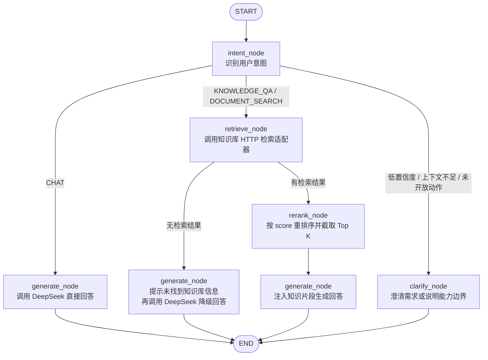

# Agent Workflow

## State Fields

- `question`: 用户当前问题
- `intent`: `CHAT` / `KNOWLEDGE_QA` / `DOCUMENT_SEARCH` / `REPORT_GENERATION` / `KB_MANAGEMENT` / `TASK_ACTION`
- `intent_confidence`: 意图识别置信度，范围为 `0.0` 到 `1.0`
- `route_reason`: 本次分类和路由的解释
- `classification_source`: `rule` / `llm` / `fallback`
- `needs_clarification`: 是否需要先追问或说明能力边界
- `mode`: `direct` / `rag` / `clarify`
- `selected_kb_ids`: 用户选择的知识库范围
- `retrieved_docs`: 标准化后的检索片段
- `thinking_steps`: 给 SSE 思考过程展示使用的步骤
- `citations`: 回答引用来源
- `final_response`: 最终回答
- `error`: 受控错误信息

## Knowledge Adapter Contract

未来知识库组只需要提供 `KNOWLEDGE_SEARCH_URL` 对应的 HTTP 接口。Agent 会发送 `query`、`selected_kb_ids`、`top_k`、`similarity_threshold`、`embedding`，并接收包含 `doc_id`、`doc_name`、`kb_id`、`snippet`、`score`、`metadata` 的文档列表。

## Intent Routing Notes

- 规则优先处理高确定性问题；规则无法判断时才尝试 LLM 结构化分类。
- LLM 不可用或返回非法结构时，Agent 进入安全兜底澄清，不默认走 RAG。
- `REPORT_GENERATION`、`KB_MANAGEMENT`、`TASK_ACTION` 当前只识别不执行，统一走 `clarify`。
- 混合请求中如果同时包含文档检索和未开放动作，例如“查找文档并生成一份报告”，未开放动作优先进入 `clarify`，避免误触发 RAG。

## Intent Classification Contract

`intent_node` 输出结构化分类结果，并把字段写入 `AgentState`：

- `intent`: 最终识别的意图。
- `intent_confidence`: 归一化置信度，低于阈值时进入 `clarify`。
- `route_reason`: 可展示给 B 端或用于排查误判的路由原因。
- `classification_source`: `rule` 表示规则命中，`llm` 表示 LLM 结构化分类，`fallback` 表示无法可靠分类后的安全兜底。
- `needs_clarification`: `true` 时不检索，直接进入 `clarify_node`。

规则优先级：

1. 闲聊：`CHAT` → `direct`。
2. 报告生成：`REPORT_GENERATION` → `clarify`。
3. 知识库管理：`KB_MANAGEMENT` → `clarify`。
4. 任务动作：`TASK_ACTION` → `clarify`。
5. 文档检索：`DOCUMENT_SEARCH` → `rag`。
6. 模糊请求：低置信度 `KNOWLEDGE_QA` → `clarify`。
7. 明确知识问答：`KNOWLEDGE_QA` → `rag`。
8. 规则无法判断：尝试 LLM；LLM 不可用或结果非法时 → `fallback` + `clarify`。

## Golden QA Cases

| 用户输入 | 意图 | 路由 | 说明 |
|---|---|---|---|
| `你好，请介绍一下你自己` | `CHAT` | `direct` | 闲聊不触发检索 |
| `什么是电力技术监督？` | `KNOWLEDGE_QA` | `rag` | 明确知识问答进入 RAG |
| `帮我检索技术监督管理办法相关文档` | `DOCUMENT_SEARCH` | `rag` | 明确文档检索进入 RAG |
| `请生成一份技术监督月报` | `REPORT_GENERATION` | `clarify` | 只识别，不执行报告生成 |
| `帮我创建知识库并上传文档` | `KB_MANAGEMENT` | `clarify` | 只识别，不执行知识库 CRUD |
| `提醒我明天提交审批` | `TASK_ACTION` | `clarify` | 只识别，不执行任务动作 |
| `帮我分析一下` | `KNOWLEDGE_QA` | `clarify` | 上下文不足，先追问 |
| `查找文档并生成一份报告` | `REPORT_GENERATION` | `clarify` | 混合意图中未开放动作优先 |
