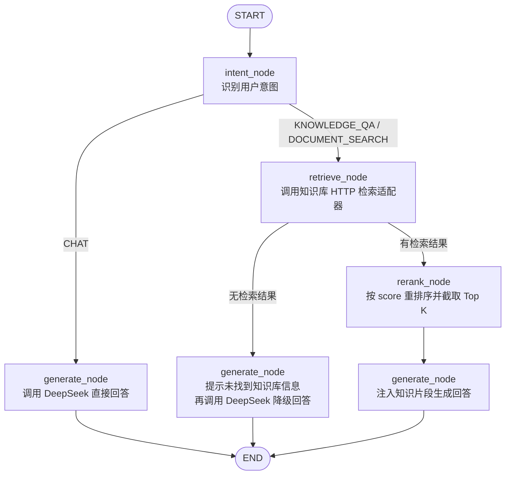

# Agent Workflow

## State Fields

- `question`: 用户当前问题
- `intent`: `CHAT` / `KNOWLEDGE_QA` / `DOCUMENT_SEARCH`
- `mode`: `direct` / `rag`
- `selected_kb_ids`: 用户选择的知识库范围
- `retrieved_docs`: 标准化后的检索片段
- `thinking_steps`: 给 SSE 思考过程展示使用的步骤
- `citations`: 回答引用来源
- `final_response`: 最终回答
- `error`: 受控错误信息

## Knowledge Adapter Contract

未来知识库组只需要提供 `KNOWLEDGE_SEARCH_URL` 对应的 HTTP 接口。Agent 会发送 `query`、`selected_kb_ids`、`top_k`、`similarity_threshold`、`embedding`，并接收包含 `doc_id`、`doc_name`、`kb_id`、`snippet`、`score`、`metadata` 的文档列表。
